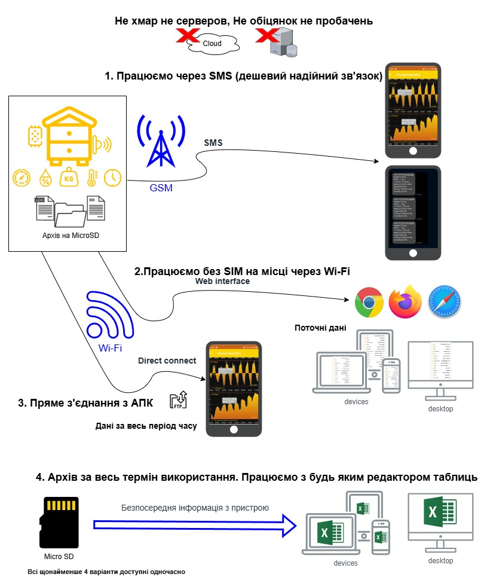

Language: [English](README.md) | [Українська](README.uk.md) | [Polski](README.pl.md) | [Deutsch](README.de.md)

Benutzerhandbuch [.pdf](https://github.com/Ivan-Bdgilko/Apiary_docs/blob/main/User%20Manual.pdf)

Videoanleitungen [youtube](https://www.youtube.com/@beeApiary)

Android APP [тут](https://play.google.com/store/apps/details?id=com.beeapiary)

Firmware-Update [тут](https://github.com/Ivan-Bdgilko/Hive_Controller)

Bestellen kann man hier:
 - [OLX](https://www.olx.ua/d/uk/obyavlenie/vagi-paschn-apiary-scales-vesy-pasechnye-vesy-gsm-wi-fi-dlya-paseki-IDUTO1F.html)
 - [OLX](https://www.olx.ua/d/obyavlenie/vesy-pasechnye-vesy-gsm-wi-fi-dlya-paseki-IDZ7kfw.html)
 - [apkua](https://apkua.com/ua/agroboard/i-502780/vagi-pasichni-apiary-scales-vesy-pasechnye-vesy-gsm-wi-fi-dlya-paseki/)

**Ukrainische Entwicklung** von Imkern, die gewaltsam von ihren eigenen Bienenständen vertrieben wurden 

Der Preis ist **2–4 Mal niedriger** als bei Wettbewerbern mit **ähnlichen Möglichkeiten und vergleichbarem Funktionsumfang** 

**Hauptfunktionen** 

- Keine Server, alle Daten sind **Ihre** Daten (es gibt auch keine Abogebühr) – Kundenorientierung
- Kein Internetbedarf ermöglicht den **günstigen** Betrieb auch in Gebieten mit sehr schwachem GSM-Signal - Komfort 
- Autonomer Betrieb von **6–12 Monaten** bei vollem Funktionsumfang - Komfort 
- Die Informationen sind zeitlich synchronisiert (Gewicht, Temperaturen 2+, Luftfeuchtigkeit, Druck, Batterie, Signalstärke, Bewegungssensor) - Informationsgehalt 
- Blockbauweise: einfache und schnelle Reparatur oder Austausch - Komfort 
- Die Modularität dient dazu, bei Bedarf Funktionen am Bienenstand hinzuzufügen oder zu ändern 
- Alle Einstellungen bleiben auch bei entfernter Flash-Speicherkarte gespeichert und werden im Falle ihres Verlusts oder Ausfalls automatisch wiederhergestellt - Zuverlässigkeit 
- Tarieren und Kalibrieren sind bequem und verständlich, erledigt in 20 Sekunden - Komfort 
- Updates nur mit Erlaubnis des Benutzers - Zuverlässigkeit 
- Daten werden bei Verlust oder Austausch des Telefons wiederhergestellt - Zuverlässigkeit 
- Funktion als normale Waage (ohne SIM) über Web-Oberfläche von jedem Gerät: Telefon, Tablet, Laptop – Kundenorientierung 
- Informationsunterstützung: Anleitungen mit unterschiedlichem Detaillierungsgrad, YouTube-Einrichtungsvideos – Kundenorientierung  

**Mechanische Vorteile** 

- Ein vollständig geschlossenes Gehäuse erfordert **niemals** einen Eingriff. Es gibt keine Öffnungen und keine Tasten (alles ist geschlossen) - Zuverlässigkeit 
- Die Deckel sind transparent – falls plötzlich Feuchtigkeit oder Insekten im Inneren auftreten, sehen Sie es sofort – Zuverlässigkeit 
- Transparente Deckel ermöglichen außerdem den Blick auf den Bildschirm und darauf, ob das Gerät funktioniert - Komfort 
- Alle Boxen haben **externe** Befestigungen, ebenso wie die Sensoren – Komfort, Zuverlässigkeit 
- Alles ist maximal abgedichtet und fixiert, sodass sich ein Kabel nicht plötzlich verschieben kann (Kabelbinder, Kabelverschraubungen usw.) - Zuverlässigkeit 
- Die Platinen sind nach der Montage lackiert – das minimiert die Möglichkeit von Feuchtigkeitsschäden - Zuverlässigkeit 
- Lebenswichtige Komponenten sind abgeschirmt (maximale Genauigkeit) - Zuverlässigkeit 
- Separate Stromversorgung (3 Quellen) – Stabilität, Zuverlässigkeit – das ist schon sehr technisch, aber so ist es - Zuverlässigkeit 

**Zusätzliche Erweiterungen** 

- Android-Anwendung: erweiterte Diagramme, mehrere Geräte gleichzeitig, detaillierte stündliche Informationen, Vergleich mehrerer Geräte, Ereignisse – Imkerjournal (in Entwicklung) - Komfort 
- Bildschirm, Solarpanel (dauerhafte Stromversorgung), größere Batterie, externe Antenne 
- Schutz, Überschreitung von Grenzwerten – Notfallbenachrichtigung des Besitzers (20 Sekunden) 
- Alle Messinformationen werden zusätzlich in separaten Dateien nach Monaten und Jahren in einem praktischen Tabellenformat (.CSV) auf dem Gerät gespeichert - Komfort 
- Große Anzahl an Einstellungen: - Flexibilität 
  - SMS für den Benutzer (Opa-Style), Android-Anwendungen 
  - Mehrere Benachrichtigungsnummern 2+ 
  - Notfallbenachrichtigungen  
  - Flexibler Zeitplan für die Erstellung von Nachrichten 
  - Mögliche Nutzung ohne Waage als Wetterstation oder in anderen Kombinationen 
  - Zeitsynchronisierung mit dem Telefon oder NTP nach Wunsch 
  - Alle zusätzlichen Einstellungen sind offen und haben eine ausführliche Beschreibung (.XML) - Komfort 
- Geschützte Batterie, das Gerät verfügt über 3 Ebenen der Stromversorgungskontrolle, die verhindern, dass die Batterie selbst nach mehreren Jahren ohne Zugriff auf das Gerät „getötet“ wird – Zuverlässigkeit 
- Die Protokollierung des Gerätebetriebs ermöglicht es, Probleme aus der Ferne zu erkennen, falls sie auftreten - Komfort 
- Unterstützung für FTP-Verbindungen ermöglicht das Hochladen von Dateien und das Aktualisieren der Firmware, ohne die Box zu öffnen (FileZilla für Feinschmecker) – Zuverlässigkeit 

Sprachen: Ukrainisch, Englisch, Polnisch; das Hinzufügen weiterer Sprachen dauert 1 Stunde mit Hilfe eines Muttersprachlers oder Übersetzers, **außer der Sprache des Feindes.**  

Wir nehmen auch Verbesserungsvorschläge sowie Hilfe in Form von Informationsunterstützung zur Verbreitung des Geräts an. 

Die aktive Entwicklungsphase ist abgeschlossen, das Projekt ist stabil, aber wir freuen uns immer über Verbesserungen. – Offenheit und Unabhängigkeit 

 
### Wie man Daten erhält 

 
 
### Kurzbeschreibung 
- Lange autonome Betriebszeit — mehr als 3 Monate
- Für das Gerät ist kein Internet erforderlich - ein minimales GSM-Paket oder eine zweite SIM-Karte auf derselben Nummer. 0 - für die Verbindung, nur SMS
- Direktes Herunterladen der Daten vom Gerät ist für ein JAHR oder für die gesamte Nutzungsdauer verfügbar

### Zweck
 Entwickelt für die kontinuierliche Überwachung eines Bienenstocks/Bienenstands, die Übertragung von Informationen an das mobile Gerät des Benutzers und/oder die Speicherung von Daten in einem Archiv usw.
Das Gerät misst folgende Parameter:
- Bienenstockgewicht 200+ kg
- Temperatur: 2 Sensoren, die innerhalb und außerhalb des Bienenstocks platziert sind
- Luftfeuchtigkeit Option
- Druck Option
- Schutz des Bienenstocks/Bienenstands, Bewegungssensor Option

Anzeige von Informationen auf dem Bildschirm Option

Alle Informationen sind zeitlich synchronisiert und werden während der gesamten Nutzungsdauer des Geräts gespeichert, unabhängig von der Verfügbarkeit der Verbindung. Dadurch ist es möglich, mit den Daten mit oder ohne Gerät mithilfe anderer externer Tabellenverarbeitungssoftware zu arbeiten.

Fragen können per E-Mail gestellt werden: Apiary4.bee@gmail.com

Videoübersicht [тут](https://www.youtube.com/watch?v=h_UnnLXA2ws)
Videoübersicht [тут](https://www.youtube.com/watch?v=HyZ8Eq862ug)

Ungefähre Kosten — etwa 5000 UAH. *Bitte bestätigen*

Suchanfragen: *Ваги пасічні, Apiary scales*

Servicehandbuch [.pdf](https://github.com/Ivan-Bdgilko/Apiary_docs/blob/main/Service%20Manual.pdf)

