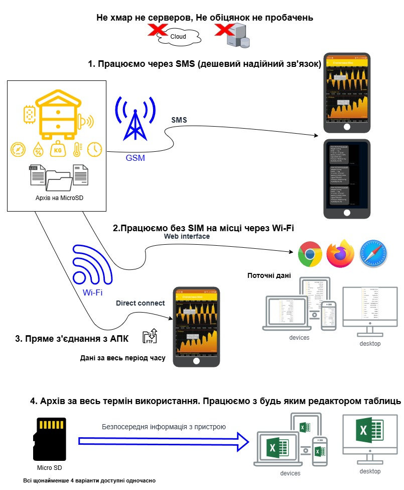

Інструкція користувача [.pdf](https://github.com/Ivan-Bdgilko/Apiary_docs/blob/main/User%20Manual.pdf)

Відео інструкції [youtube](https://www.youtube.com/@beeApiary)

Android APP [тут](https://github.com/Ivan-Bdgilko/Android_Apk)

Оновлення прошивки [тут](https://github.com/Ivan-Bdgilko/Hive_Controller)

Замовити можна тут:
 - [OLX](https://www.olx.ua/d/uk/obyavlenie/vagi-paschn-apiary-scales-vesy-pasechnye-vesy-gsm-wi-fi-dlya-paseki-IDUTO1F.html)
 - [apkua](https://apkua.com/ua/agroboard/i-502780/vagi-pasichni-apiary-scales-vesy-pasechnye-vesy-gsm-wi-fi-dlya-paseki/)

**Українська розробка** бджолярів вимушено переміщених з власних пасік 

Ціна **нижча в 2-4 раз**и від конкурентів маючих **схожі можливості та об’єм функціоналу** 

**Основні можливості** 

- Немає серверів, всі дані то **ваші** дані (абонплати теж немає) – клієнт-орієнтованість
- Відсутність потреби в інтернет дозволяє працювати **дешево** та в зонах дуже слабкого сигналу GSM - зручність 
- Автономність **6-12 місяців** при повному функціоналі - зручність 
- Інформація  синхронізована  за  часом  (вага,  температури  2+,  вологість,  тиск,  батарея,  рівень сигналу, датчик руху)- інформативність 
- Блочна конструкція: легкий та швидкий ремонт або заміна- зручність 
- Модульність має мету при бажанні додавати або змінювати функціонал на пасіці 
- Всі налаштування зберігаються навіть зі знятою флеш та відновлюються автоматично на випадок її втрати або виходу з ладу - надійність 
- Тарування, калібрування зручно та зрозуміле, робиться за 20 сек - зручність 
- Оновлення тільки з дозволу користувача - надійність 
- Дані відновлюються при втраті або заміні телефона - надійність 
- Функція звичайні ваги(без SIM) через Web інтерфейс з будь яким пристроєм: телефон, планшет, ноутбук –клієнт-орієнтованість 
- Інформаційна підтримка: інструкції різного ступеню глибини, відео налаштування youtube –клієнт- орієнтованість  

**Механічні переваги** 

- Повністю закритий корпус не потрібує втручання **ніколи**. Нема отворів та кнопок (все закрито) - надійність 
- Кришки прозорі – якщо волога або комахи раптово там, ви їх побачите одразу – надійність 
- Прозорі кришки також дозволяють бачити екран та чи працює пристрій - зручність 
- Всі бокси мають **зовнішні** кріплення як і датчики – зручність, надійність 
- Все максимально герметизовано та зафіксовано не дозволяє раптово посунути кабель (стяжки гермовводи тощо) - надійність 
- Плати покрити лаком після монтажу – мінімізує можливість пошкодження вологою- надійність 
- Життєво важливі компоненти екрановані(максимальна точність) - надійність 
- Окреме живлення (3 джерела) – стабільність, надійність – то вже дуже технічне але як є - надійність 

**Додаткові розширення** 

- Андроїд  аплікація  розгалужені  графіки,  декілька  пристроїв  одночасно,  детальна  інформація погодинно, порівняння декількох пристроїв, події – журнал бджоляра (в розробці) - зручність 
- Екран, сонячна панель (живлення назавжди), збільшена батарея, зовнішня антена 
- Охорона, вихід параметрів за межі – аварійне інформування володаря (20сек) 
- Вся інформація про виміри також зберігається в окремих файлах по місяцях та роках в зручному табличному форматі(.CSV) на пристрої  - зручність 
- Велика кількість налаштувань: - гнучкість 
  - SМS для користувача (дідусь стайл), андроїд аплікації 
  - Декілька номерів інформування 2+ 
  - Інформування аварійне  
  - Гнучкий графік створення повідомлень 
  - Можливо використання без ваг як метео або інші комбінації 
  - Синхронізація часу з телефонам або NTP за бажанням 
  - Всі додаткові налаштування відкриті та мають детальний опис (.XML) - зручність 
- Захищена батарея, пристрій має 3 рівні контролю за живлення які не дозволять «вбити» батарею навіть через декілька років не звертання до пристрою – надійність 
- Логування  процесу  роботи  пристрою  дозволяє  віддалено  виявляти  проблеми  якщо  вони з’являються - зручність 
- Підтримка FTP з’єднання дозволяє завантажувати файли та оновлювати прошивку не відкриваючи коробки (для гурманів FileZilla) – надійність 

Мови: Українська, Англійська, Польська, додати інші 1 година за умов допомоги носія або перекладача, **окрім мови ворога.**  

Також ми приймаємо поради що до покращення та допомогу у вигляді інформаційної підтримки з приводу розповсюдження приладу. 

Активна фаза розробки завершена проект стабільний але покращити завжди раді. – відкритість та незалежність 

 
### Як получити дані 

 
 
### Короткий опис 
- Тривалий період автономної роботи більше 3 місяців
- Не потрібен Internet для пристрою - мінімальний пакет GSM або друга картка на Вашому ж номері. 0 - за зв'язок, тільки SMS
- Є безпосереднє завантаження данних з пристрою за РІК або весь термін користування

### Призначення
 Призначен для безперервного контролю за вуликом/пасікою, передачі інформації на мобільний пристрій користувача та/або збереження даних у архіві тощо.
Пристрій вимірює такі параметри:
- Вага вулика 200+ кг
- Температура 2 датчика, що розміщені всередині та зовні вулика
- Вологість опція
- Тиск опція
- Охорона вулика/пасіки датчик руху опція

Вивод інформації на екран опція

Вся інформація синхронізована за часом та зберігається за весь період користування пристроєм, незважаючи на наявність зв'язку, що дає можливість працювати з даними за наявності пристрою або без нього за допомогою іншого стороннього ПЗ обробки таблиць.

Питання можна задати на пошту: Apiary4.bee@gmail.com

Відео обзор [тут](https://www.youtube.com/watch?v=3bXbYNB-EKQ&t=7s)

Ориєнтовна вартість біля 4000 грн. *Уточнюйте*

Пошукові запроси: *Ваги пасічні, Apiary scales*

Сервісна інструкція [.pdf](https://github.com/Ivan-Bdgilko/Apiary_docs/blob/main/Service%20Manual.pdf)
